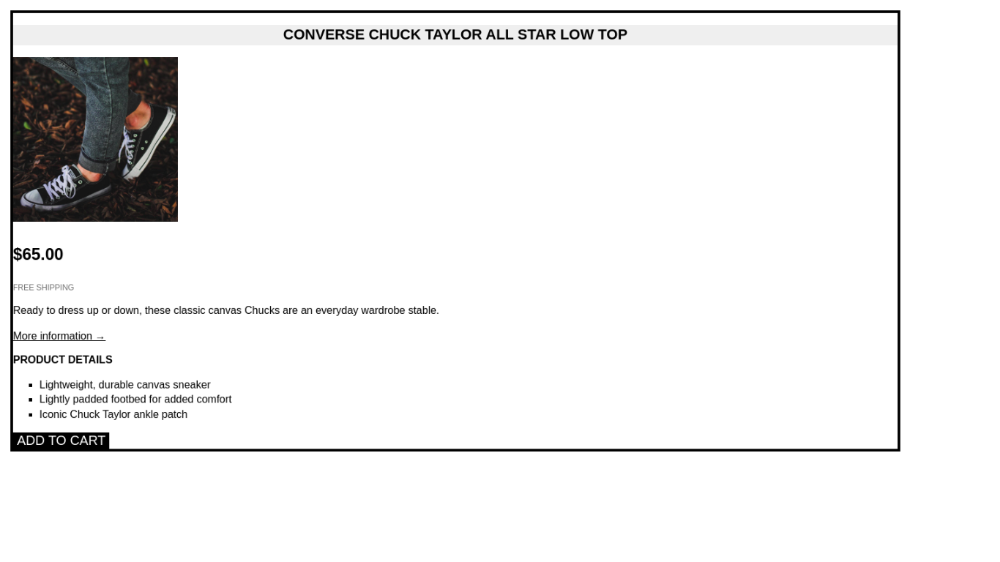
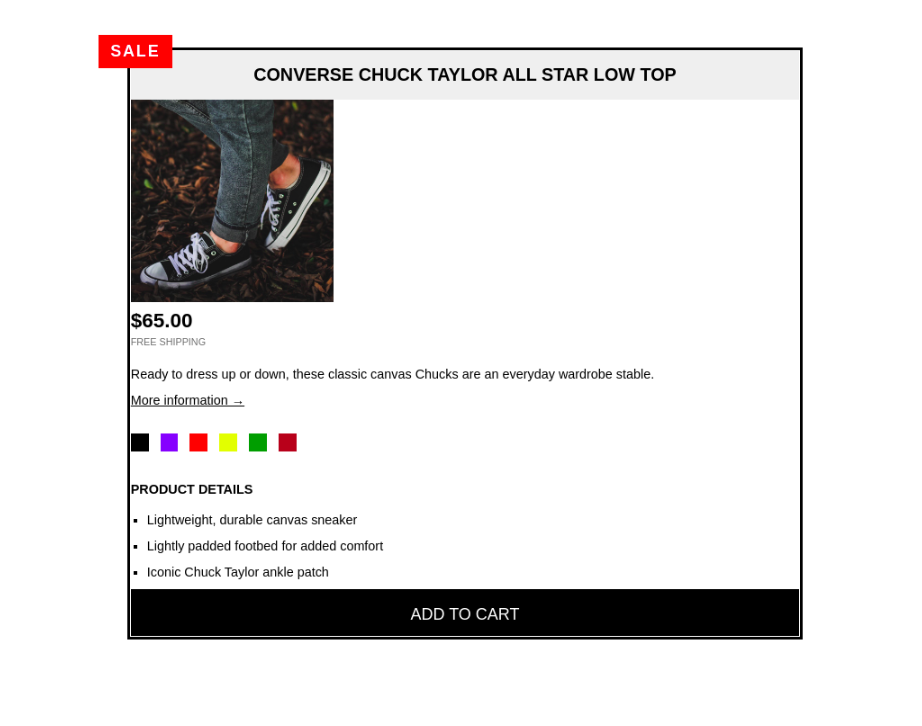
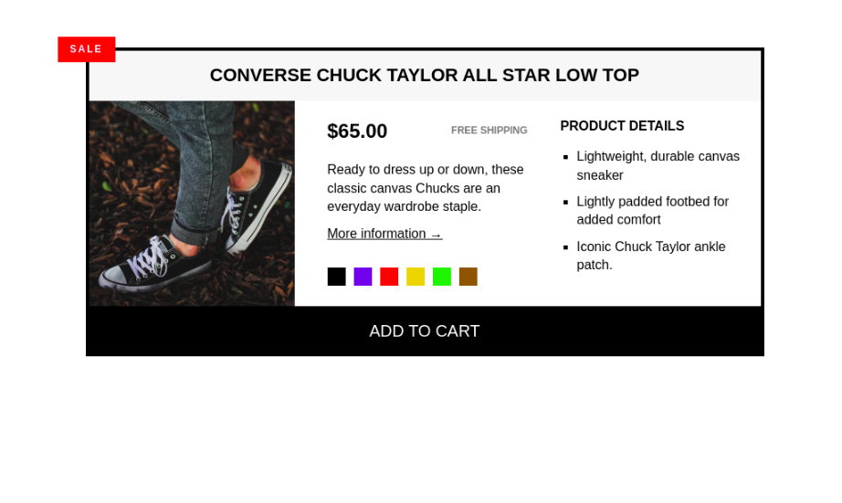

# Build Responsive Real-World Websites with HTML and CSS

## Challenges

- [x] [Section 2 – Challenge #2](./Challenges/01-Challenges/)
      
- [x] [Section 3 – Challenge #1](./Challenges/02-Challenges/)
      
- [x] [Section 3 – Challenge #2](./Challenges/03-Challenges/)
      
- [x] [Section 3 – Challenge #3](./Challenges/04-Challenges/)
      
- [x] [Section 4 – Challenge #1](./Challenges/05-Challenges/)
      
- [x] [Section 4 – Challenge #2](./Challenges/06-Challenges/)
      
- [x] [Section 4 – Challenge #3](./Challenges/07-Challenges/)
      

---

## Projects

### Omnifood

- [Project-code](./Projects/Omnifood)  
- [Live Demo](https://omnifood-osama-elshimy.netlify.app/)

---

## Code

- [Code](Code)

---

[Course-Link](https://www.udemy.com/course/design-and-develop-a-killer-website-with-html5-and-css3) 

---

## [Next Course](/02-Udemy/02-Js-Jonas/)
