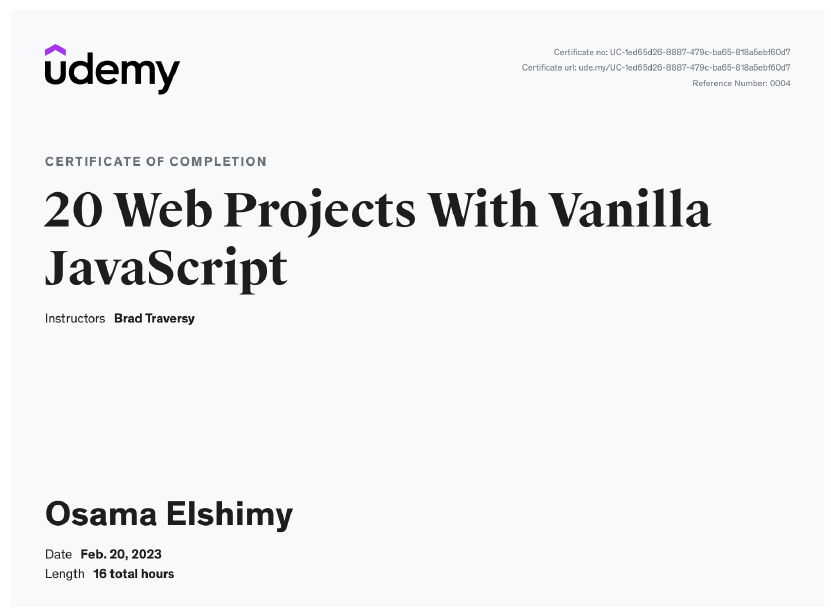

# 20+ Web Projects With Vanilla JavaScript

---

## Projects

|  #  |                          Project Code                           |                            Live Demo                             |
| :-: | :-------------------------------------------------------------: | :--------------------------------------------------------------: |
| 01  |         [Form Validator](./Projects/01-Form-Validator/)         |  [Live Demo](https://form-validator-osama-elshimy.netlify.app/)  |
| 02  |     [Movie Seat Booking](./Projects/02-Movie-Seat-Booking/)     |    [Live Demo](https://movie-seat-booking-osama.netlify.app/)    |
| 03  |    [Custom Video Player](./Projects/03-Custom-Video-Player/)    |      [Live Demo](https://custom-vidoe-player.netlify.app/)       |
| 04  |    [Exchange Rate Calculator](./Projects/04-Exchange-Rate/)     | [Live Demo](https://exchange-rate-calculator-osama.netlify.app/) |
| 05  |  [DOM Array Methods Project](./Projects/05-DOM-Array-Methods/)  |    [Live Demo](https://dom-array-methods-osama.netlify.app/)     |
| 06  |     [Menu Slider & Modal](./Projects/06-Modal-Menu-Slider/)     |   [Live Demo](https://simple-landing-page-osama.netlify.app/)    |
| 07  |             [Hangman Game](./Projects/07-Hangman/)              |       [Live Demo](https://hangman-game-osama.netlify.app/)       |
| 08  |          [Mealfinder App](./Projects/08-Meal-Finder/)           |       [Live Demo](https://meal-finder-osama.netlify.app/)        |
| 09  |        [Expense Tracker](./Projects/09-Expense-Tracker/)        |    [Live Demo](https://expense-tracker-with-js.netlify.app/)     |
| 10  |           [Audio Player](./Projects/10-Audio-Player/)           |       [Live Demo](https://quran-player-osama.netlify.app/)       |
| 11  |     [Infinite Scrolling](./Projects/11-Infinite-Scrolling/)     |  [Live Demo](https://infinite-scrolling-blogpost.netlify.app/)   |
| 12  |             [Typing Game](./Projects/12-Type-Race/)             |       [Live Demo](https://typing-game-osama.netlify.app/)        |
| 13  |     [Speech Text Reader](./Projects/13-Speech-Text-Reader/)     |    [Live Demo](https://speech-text-reader-osama.netlify.app/)    |
| 14  |           [Memory Cards](./Projects/14-Memory-Cards/)           |       [Live Demo](https://memory-cards-osama.netlify.app/)       |
| 15  |        [LyricsSearch App](./Projects/15-Lyrics-Search/)         |      [Live Demo](https://lyrics-search-osama.netlify.app/)       |
| 16  |              [Relaxer App](./Projects/16-Relaxer/)              |            [Live Demo](https://realxer.netlify.app/)             |
| 17  |            [Breakout Game](./Projects/17-Breakout/)             |      [Live Demo](https://breakout-game-osama.netlify.app/)       |
| 18  |     [New Year Countdown](./Projects/18-New-Year-Countdown/)     |    [Live Demo](https://new-year-countdown-osama.netlify.app/)    |
| 19  |          [Sortable List](./Projects/19-Sortable-List/)          |  [Live Demo](https://richest-people-sortable-list.netlify.app/)  |
| 20  | [Speak Number Guessing Game](./Projects/20-Speak-Number-Guess/) |          [Live Demo](https://speak-number.netlify.app/)          |

---

[Course-Link](https://www.udemy.com/course/web-projects-with-vanilla-javascript/) 

