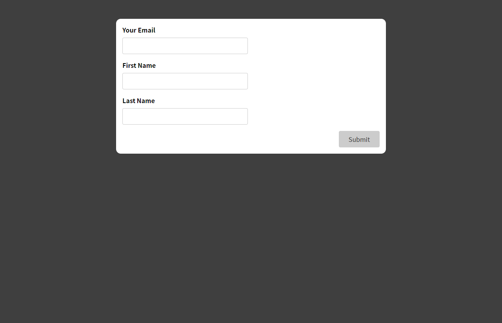
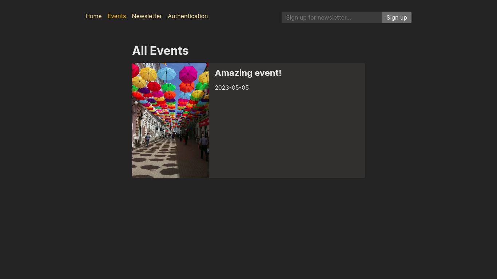
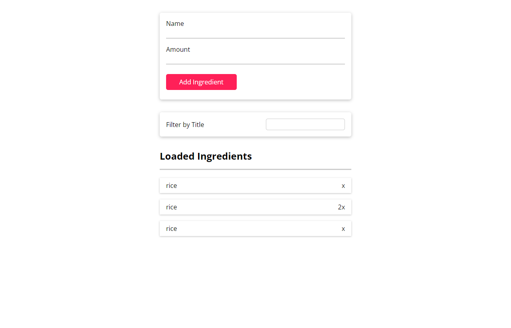

# React - The Complete Guide (incl Hooks, React Router, Redux)

---

## Projects

### expenses-app (S3-S5)

- [Section 3 Code](./Projects/01-Expenses-app/S03-project)
- [Section 4 Code](./Projects/01-Expenses-app/S04-project/)
- [Section 5 Code](./Projects/01-Expenses-app/S05-project/)

   

- [Section 3 Project Live Demo](https://expense-tracker-v1-osama.netlify.app/)
- [Section 4 Project Live Demo](https://expense-tracker-v2-osama.netlify.app/)
- [Section 5 Project Live Demo](https://expense-tracker-osama.netlify.app/)

### goals app (S6-S7)

- [Section 6 Code](./Projects/02-goals-app/S06-project/)
- [Section 7 Code](./Projects/02-goals-app/S07-project/)
   

- [Section 6 Project Live Demo](https://goals-app-v1-osama.netlify.app/)
- [Section 7 Project Live Demo](https://goals-app-osama.netlify.app/)

### Section 8-9 Project

- [Project-code](./Projects/03-section-8-9-project)
- [Live Demo](https://user-form-osama.netlify.app/)

### Login-app (S10)

- [Project-code](./Projects/04-Login-app-s10/)
- [Live Demo](https://login-landing-page-osama.netlify.app/)

### Order-food App (S11)

- [Project-code](./Projects/05-order-food-app/S11-project/)
- [Live Demo](https://food-order-app-v1.netlify.app/)

### Section 12 Project

- [Project-code](./Projects/06-S12-project)
- [Live Demo](https://behind-the-scenes-app.netlify.app/)

### Section 13 Project

- [Project-code](./Projects/07-S13-project)
- [Live Demo](https://class-based-component.netlify.app/)

### movies app(S14)

- [Project-code](./Projects/08-S14-movies-app)
- [Live Demo](https://movies-app-osama.netlify.app/)

### Tasks app with firebase(S15)

- [Project-code](./Projects/09-S15-task-app-firbase/)
- [Live Demo](https://tasks-app-firebase-osama.netlify.app/)

### Form-app(S16)

- [Project-code](./Projects/10-S16-form-app)
- [Live Demo](https://form-app-osama.netlify.app/)

### Order-food App (S17)

- [Project Code](./Projects/05-order-food-app/S17-project/)
- [Final Project Live Live Demo](https://order-food-app-osama.netlify.app/)

### Redux Counter(S18)

- [Project-code](./Projects/11-S18-redux-counter)
- [Live Demo](https://redux-counter-osama.netlify.app/)

### Redux Cart(S19)

- [Project-code](./Projects/12-S19-redux-cart)
- [Live Demo](https://redux-cart-osama.netlify.app/)

### Events App(S20, S21)

`React + Node`

- [Project-code](./Projects/13-S21-events-app)
- [Live Demo](https://react-events.onrender.com/)

### Blog(S22)

- [Project-code](./Projects/14-S22-Blog)
- [Live Demo](https://react-blogpost-osama.netlify.app/)

### Meetups app(S23)

- [Project-code](./Projects/15-S23-meetups-app)
- [Live Demo](https://next-meetups-sigma.vercel.app/)

### Animation-app (S24)

- [Project-code](./Projects/16-S24-animation-app)
- [Live Demo](https://react-animation-app.netlify.app/)

### Products-app(S25)

- [Project-code](./Projects/17-S25-Products-app)
- [Live Demo](https://react-products-site.netlify.app/)

### todo-app-TS(S27)

- [Project-code](./Projects/18-S27-todo-app-TS)
- [Live Demo](https://react-products-site.netlify.app/)

### ingredients-app(S28)

- [Project-code](./Projects/19-S28-ingredients-app/)
- [Live Demo](https://react-typescript-todo-app-osama.netlify.app/)

### React Poster(s29)

`React + Node`

- [Project-code](./Projects/20-S29-react-poster/)
- [Live Demo](https://react-poster.onrender.com/)

---

## Code

##### Assignments included

### [code](Code)

---

[Course-Link](https://www.udemy.com/course/react-the-complete-guide-incl-redux/) 

---

## [Next Course](/02-Udemy/05-Nodejs-Maximilian/)
