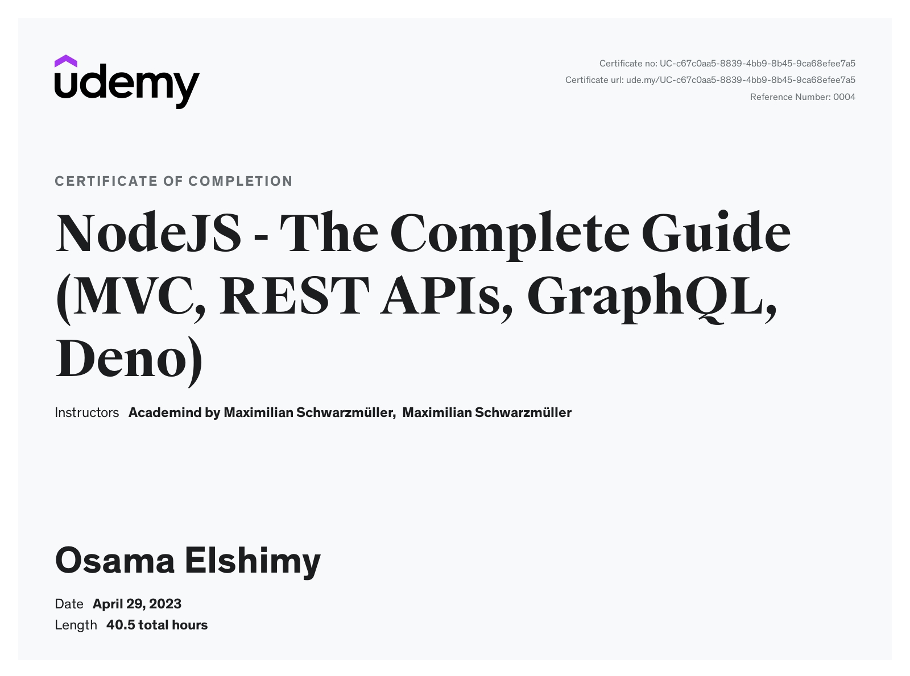

# NodeJS - The Complete Guide (MVC, REST APIs, GraphQL, Deno)

---

## Projects

### Shop (S05 - S23, S29)

#### Project Code

- [S05- Express](./Projects/01-Shop/S05-Express/)
- [S07 - MVC](./Projects/01-Shop/S07-MVC/)
- [S09 - Dynamic Routes](./Projects/01-Shop/S09-Dynamic-Routes/)
- [S11- Sequelize](./Projects/01-Shop/S11-Sequelize/)
- [S13 - Mongoose](./Projects/01-Shop/S13-Mongoose/)
- [S15- Authentication](./Projects/01-Shop/S15-Authentication/)
- [S17- Advanced Authentication](./Projects/01-Shop/S17-Advanced-Authentication/)
- [S18- Validating Errors](./Projects/01-Shop/S18-Validating-Input/)
- [S19- Handling Errors](./Projects/01-Shop/S19-Handling-Errors/)
- [S20- Uploading Files ](./Projects/01-Shop/S20-Uploading-Files/)
- [S21- Pagination](./Projects/01-Shop/S21-Pagination/)
- [S23- Payment](./Projects/01-Shop/S23-Payment/)
- [S29- Deployment](./Projects/01-Shop/S29-Deployment/)

#### [Finished Live Demo](https://node-shop-whzv.onrender.com/)

### Social Feed (S25 - S28)

#### Project Code

- [S25- Rest API](./Projects/02-Social-Feed/S25-Rest-API/)
- [S27- Web Socket](./Projects/02-Social-Feed/S27-Web-Socket/)
- [S28- Graphql](./Projects/02-Social-Feed/S28-Graphql/)

#### [Finished Live Demo](https://social-feed-3zdv.onrender.com/)

---

## Code

[code](Code)
[assignments](Code/Assignments/)

---

[Course-Link](https://www.udemy.com/course/nodejs-the-complete-guide/) 

 
