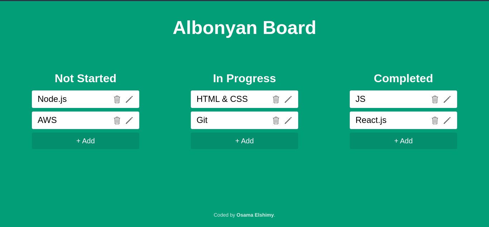
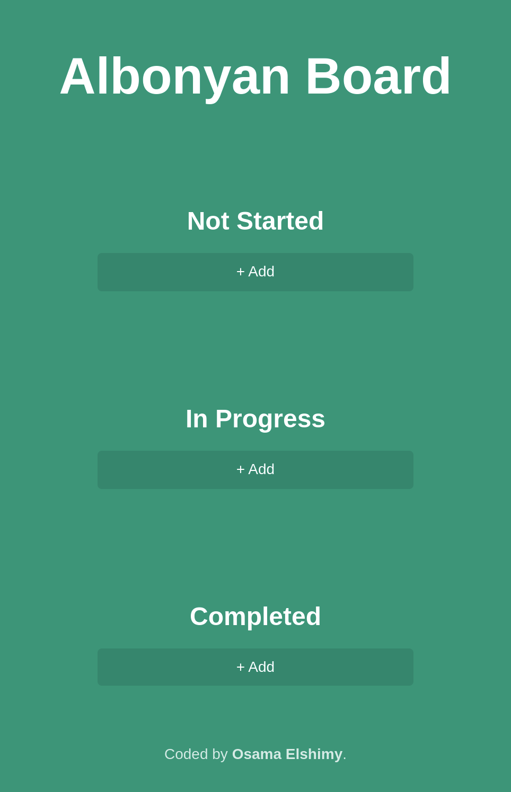

# Kanban Board

## Features

- Create new tasks, view existing tasks, edit tasks, and delete tasks.
- Save tasks to browser local storage for persistence across sessions.
- Task sorting by due date, priority level, or task status.
- Move tasks from one category to another using drag and drop.
- Responsive design optimized for desktop and mobile devices.

### DEMO

- Desktop
  

- Mobile
  

## [LIVE DEMO](https://albonyan-board.netlify.app/)
